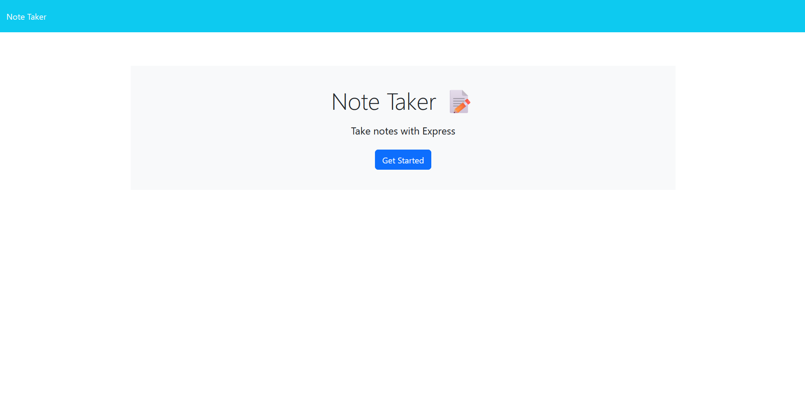
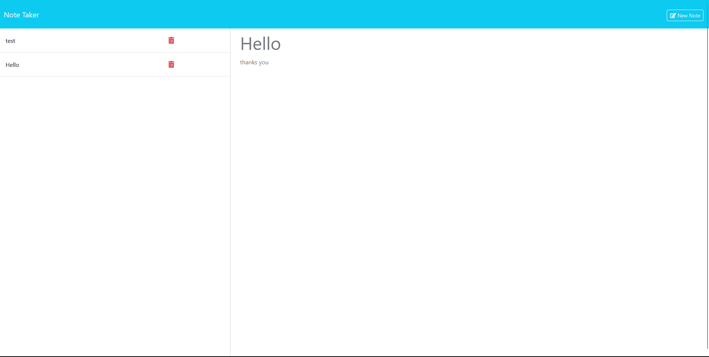

# Note Taker

## This is a simple Note Taker

*This is a simple Note Taker that you can use on the web browser.

*I was abe to build this note take with the following uuid and express.
* they were a lot headache when trying to build something when you just learn something new with coding.

*I learn that backend is a lot easy then frontend 

